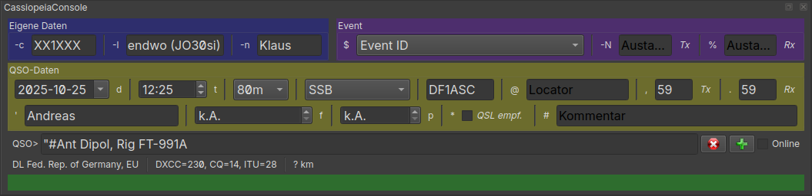

Arbeiten mit der CassiopeiaConsole (HamCC)
==========================================

Wenn Du CassiopeiaConsole zur schnellen Eingabe von QSOs nutzen möchtest, starte die Konsole mit `Strg+K` 
und fange mit der Eingabe rechts neben `QSO>` an.
Das Eingabefeld erhält Automatisch den Fokus. Sollte der Fokus auf einem anderen Element liegen 
(weil Du etwas anderes angeklickt hast) kann der Fokus mit `Strg+K` wieder auf das Eingabefeld gesetzt werden.

Die einzelnen Blöcke müssen jeweils einem speziellen Eingabeformat entsprechen (s. unten),
um als gültige QSO-Information verarbeitet werden zu können.

Du kannst die Felder aber auch direkt editieren. Das ist allerdings nicht ratsam, 
da es die Eingabegeschwindigkeit deutlich reduziert. 
Aber es hilft, solange Du mit der Konsole noch nicht richtig vertraut bist.

Deine eigenen Daten (Rufzeichen, Locator, Name) sollte bereits mit Deinen Standarddaten gefüllt sein.
Wenn nicht, oder wenn Du etwas kurzfristig ändern möchtest, können die Daten auch über die Eingabezeile bearbeitet werden.

CassiopeiaConsole ist zur schnellen Eingabe der wichtigsten QSO-Infos gedacht; 
insbesondere im Contest-Betrieb oder wenn Du reihenweise QSL-Karten abtippst. 
Daher stehen auch nicht alle Felder zur Verfügung.

Beispielsitzung
---------------

Drücke `Strg+K` um die CassiopeiaConsole zu öffnen. Die Eingabemarke sollte in die Zeile hinter `QSO>` springen. 

Nun

1. tippst Du `8` oder `80m` gefolgt von einem `Leerzeichen` und CassiopeiaConsole setzt das 80m-Band
2. tippe `s` oder `ssb` und CassiopeiaConsole speichert den Modus SSB, nachdem Du `Leerzeichen` betätigt hast
3. Bereit für das erste QSO? Ah, `DF1ASC` ruft CQ. Also tippe das Rufzeichen ein gefolgt von einem `Leerzeichen` 
   (Ich denke es ist angekommen: Drücke `Leerzeichen` nach jedem Info-Block. Das werde ich jetzt nicht mehr extra erwähnen)
4. Dein QSO-Partner sagt Dir, sein Name sei Andreas und Du tippst das als `'Andreas`
5. Du möchtest noch einen Kommentar hinzufügen? Tippe `"#Ant Dipol, Rig FT-991A"`
6. Um das gesamte QSO in die Datenbank zu schreiben Drücke `Enter`

Anstelle der `Enter`-Taste kannst Du auch das `+` rechts neben dem Eingabefeld drücken.
Tippst Du `~` oder betätigst Du `x` wird die aktuelle Eingabe zurückgesetzt (außer den Daten im Speicher).

Du hast bestimmt festgestellt, dass für das nächste QSO einige Informationen gespeichert wurden. 
Die Tabelle unten zeigt die gespeicherten Felder mit dem Typ `Speicher`. 
Alle anderen Angaben werden fürs nächste QSO entfernt.

Eingabeformat
-------------

Die Tabelle erläutert alle verfügbaren Pre- und Postfixes. 

Als Platzhalter steht `x` für Zeichen und `9` für Zahlen.
Informationen vom Type `Auto` werden vorausgefüllt und können überschrieben werden. 
Typen, die mit `Speicher` markiert sind, werden für das nächste QSO gespeichert.

| Info                  | Format                  | Typ      | Kommentar                                                     |
|-----------------------|-------------------------|----------|---------------------------------------------------------------|
| Rufzeichen            | xx9xx                   | -        | Formatprüfung                                                 |
| Locator/QTH           | @xx99xx or @QTH(xx99xx) | -        | Formatprüfung (max. 8-stelliger Locator)                      |
| Name                  | 'xxxx                   | -        |                                                               |
| Kommentar             | #xxxx                   | Speicher |                                                               |
| Band                  | valid ADIF band         | Speicher |                                                               |
| Mode                  | valid ADIF mode         | Speicher |                                                               | 
| RST empfangen         | .599                    | Auto     | Standard CW 599, Phonie 59                                    |
| RST gesendet          | ,599                    | Auto     | Standard CW 599, Phonie 59                                    |
| QSL empfangen         | *                       | -        | Ändert die Info                                               |
| Event ID              | $xxxxxx                 | Speicher | Contest ID oder POTA, SOTA                                    |
| Empfangener Austausch | %xxxxx                  | -        | Contest-Austausch oder xOTA-Referenz                          |
| Zeit                  | HHMMt                   | Speicher | teilweise Eingaben werden ergänzt (s. Hinweis unten)          |
| Datum                 | YYYYMMDDd               | Speicher | teilweise Eingaben werden ergänzt (s. Hinweis unten)          |
| Datum/Zeit            | =                       | Auto     | Sync Datum/Zeit auf Jetzt                                     |
| Frequenz              | 99999f                  | Speicher | in kHz                                                        |
| TX-Leistung           | 99p                     | Speicher | in W                                                          | 
| Dein Call             | -cxx9xx                 | Speicher | Vorausgefüllt mit Standard aus Stationseinstellungen          | 
| Dein Locator          | -lxx99xx                | Speicher | Vorausgefüllt mit Standard aus Stationseinstellungen          | 
| Dein Name             | -nxxxx                  | Speicher | Vorausgefüllt mit Standard aus Stationseinstellungen          |
| QSO speichern         | ENTER-Key               | Kommando |                                                               |
| QSO rücksetzen        | ~                       | Kommando | Setzt das aktuelle QSO zurück                                 |
| QSO-Daten zeigen      | ?                       | Kommando |                                                               |
| Gesendeter Austausch  | -N9 or -Nxx             | Auto     | Setzt die Startnummer für Conteste oder die xOTA-Referenz     |
| Onlinemodus wechseln  | -o                      | Kommando | Wechselt Onlinemodus (automatische Datum/Zeit beim Speichern) |
| Zeige Version         | -V                      | Kommando |                                                               |

Rufzeichen, Mode, Locators, RST und Contest ID können in Kleinbuchstaben eingegeben werden und werden automatisch 
in Großbuchstaben konvertiert.

Bei einigen Infos ist es erlaubt `_` anstelle eines Leerzeichens zu verwenden. Dies wird automatisch umgewandelt.

    QSO> #Langer_Kommentar 'Langer_Name

Alternativ können die Angaben auch in Anführungszeichen eingeschlossen werden

    QSO> "#Langer Kommentar" "'Langer Name"

### RST

RST unterstützen den gesamten Bereich von `59` für Phonie, `599` für CW oder `-06` für Digimodes.

Für CW kann das letzte Zeichen auch aus `a` für Aurora, `s` für Scatter oder ähnlichen bestehen
(s. [RST-System](https://de.wikipedia.org/wiki/RST-System) auf Wikipedia).

### Datum und Zeit

Wenn Du nur Minuten bei der Zeit eingibst, z.B. `23t` wird die Zeit automatisch mit der zuletzt eingegebenen Stunde ergänzt
als hättest Du `1823t` getippt (Annahme, die letzte Uhrzeit war 18:12 oder ähnlich).

Ein teilweises Datum wird ähnlich aufgefüllt immer für je 2 fehlende Zeichen von links nach rechts.
D.h. die Eingabe `240327d`, `0327d` or `27d` wird aufgefüllt als z.B. `20240327d`.

hostilog-Kürzel für Bänder und Modi
-----------------------------------

CassiopeiaConsole (HamCC) ist sehr stark von [hostilog](https://df1lx.darc.de/hosti-logger/) von Peter, DF1LX inspiriert.

HamCC unterstützt daher die [hostilog](https://df1lx.darc.de/hosti-logger/) Tastaturkürzel für Modi und Bänder.

### Für Bänder

Es werden nur die Kürzel des hostilog-Kurzwellenmodus unterstützt:

| Kürzel | Bedeutung |
|--------|-----------|
| 0      | 160m      |
| 1      | 10m       |
| 2      | 20m       |
| 3      | 30m       |
| 4      | 40m       |
| 5      | 15m       |
| 6      | 12m       |
| 7      | 17m       |
| 8      | 80m       |
| 9      | 60m       |
| -2     | 2m        |
| -4     | 4m        |
| -5     | 6m        |
| -6     | 60m       |
| -7     | 70cm      |

### Für Modi

| Kürzel | Bedeutung    | Kommentar                    |
|--------|--------------|------------------------------|
| S      | SSB          |                              |
| C      | CW           |                              |
| R      | RTTY         |                              |
| A      | AMTOR        |                              |
| D      | MFSK         | MFSK zur ADIF-Kompatibilität |
| F      | FM           |                              |
| H      | HELL         |                              |
| J      | JT65         |                              |
| P      | PSK          |                              |
| T      | FT8          |                              |
| M      | MFSK         | Erweiterung                  |
| DV     | DIGITALVOICE | Erweiterung                  |

Eventmodus für Conteste und xOTA
--------------------------------

Sobald ein Contest ausgewählt ist, wird der eigene Austausch je QSO um eins hochgezählt.
Der eigene Austausch beginnt bei 001. Wird der Contest unterbrochen bzw. das Programm beendet so kann nach einem Neustart die laufende Nummer mit `-N` gesetzt werden.
Ist für den Contest keine laufende Nummer vorgesehen, dann kann diese Nummer einfach ignoriert werden (s. [Contests](EN_70_CONTESTS.md)).

Ein Ändern des Contests setzt den QSO-Zähler wieder auf 001.

Der empfangene Austausch wird als Zeichen oder Nummer genommen, passend zum Contest.

Zum Beenden des Contest-Modus reicht es ein `$` gefolgt von einem `Leerzeichen` zu tippen.

### xOTA

Für xOTA wird einfach SOTA oder POTA z.B. als `$pota` anstelle der Contest ID eingegeben.
Dann musst Du noch Deine eigene xOTA-Referenz mit `-Nxx-999` setzen und 
die Referenz des QSO-Partners mit `%xx-999` aufzeichnen.

Copyright von HamCC
-------------------

Der Quellcode und das eigenständige Release von HamCC sind auf [GitHub](https://github.com/gitandy/HamCC) verfügbar.

HamCC - CassiopeiaConsole &copy; 2024 by Andreas Schawo is licensed
under [CC BY-SA 4.0](http://creativecommons.org/licenses/by-sa/4.0/) 
