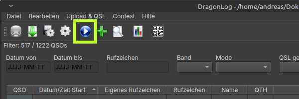

Hamlib einrichten
==================

Um aktuelle Einstellungen des Funkgerätes zu lesen oder die Frequenz aus DxSpots zu setzen kann DragonLog hamlib nutzen.

Das QSO-Formular und die CassiopeiaConsole erhalten automatisch folgende Funkgeräte-Informationen:

* Frequenz (und Band)
* Mode (und Submode)
* Leistung

Außerdem kann aus DxSpot heraus die Frequenz eingestellt werden.

Hamlib kann auf https://github.com/Hamlib/Hamlib/releases herunter geladen werden.
DragonLog wurde mit Version 4.5.5, 4.6.2 and 4.6.5 getestet.

Nach dem Einstellen des Funkgerätes und der Schnittstellenparameter kannst Du mit dem Startknopf 
die Kommunikation starten.

Aktuell kann DragonLog nur Funkgeräte mit seriellen Schnittstellen (einschließlich USB-Seriell) ansprechen.

Unter Windows
-------------

Das hamlib-Release muss nur in ein beliebiges Verzeichnis entpackt werden.

In den CAT-Einstellungen muss das Installationsverzeichnis ausgewählt werden, dass `rigctld.exe` enthält.

Unter Linux
-----------

Wenn kein Packet für Deine Distribution zur Verfügung steht, dann muss das hamlib-Release manuell kompiliert werden.

Das Release kann als .tar.gz, enpackt  und mit `./configure`, `make`, `make install` installiert werden.
DragonLog erwartet rigctld auf Deiner PATH-Variablen (z.B. in `/usr/local/bin`).

Funkgeräte mit bestätigter Funktion
-----------------------------------

Für die folgenden Funkgeräte liegt eine Bestätigung der Funktion 
mit DragonLog vor (lesen der Frequenz, Band, Mode, Leistung und setzen der Frequenz).

* FT991-A
* X6100

Bitte sendet mir eine Mail für Funkgeräte die funktionieren oder mit denen Probleme auftreten.
