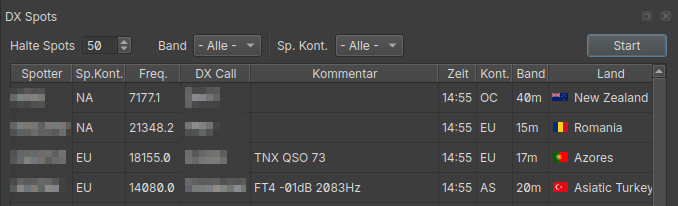
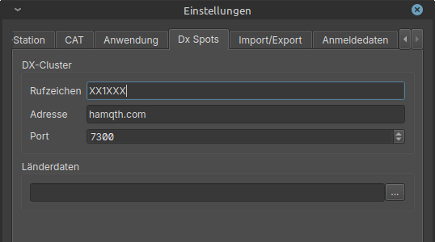

DxSpots & Country Data
======================

DragonLog provides a viewer for DxSpots which can be opened via `Ctrl+D`.

Pressing the start button connects to the Dx cluster and starts displaying spots as they are received.
Pressing the button (now showing "Stop") again disconnects from the cluster.

You can filter for a band and spotter continent. 
With `Keep spots` you can change the amount of spots which are kept in memory.

If [Hamlib](EN_90_SETUP_HAMLIB.md) is properly setup and running the frequency of your radio can be tuned 
to the spotted frequency by double-clicking an entry in the list.

Setup Dx Spots
--------------

To use Dx Spots DragonLog needs your Dx Spot telnet source and the callsign you want to use.

Usually you will use your callsign with a dash and a number added e.g. XX1XXX-1.

Sources for Dx Spots I prefer
* hamqth.com port 7300
* dx.da0bcc.de port 7300

Notes about the Flag display
----------------------------

The flag display is based on the mapping from [Flagpedia.net](https://flagpedia.net) 
and matched against the Big CTY data. This is sometimes weak and thus error-prone and needed manual fixes. 
There are still 15% unmapped (mostly islands).

If a flag is mapped wrong, please stay calm and drop me a mail. 
The mapping does not reflect my view on country borders.

Country Data
------------

Each release of DragonLog provides a very recent country data file.

If you want to update it manually visit https://www.country-files.com/category/big-cty/ by Jim, AD1C 
and download a Big CTY Zip file.

Unpack the Zip and goto `Settings - Dx Spots` (s. image above) to select the file.

You can check if the file is correctly loaded via `Help - About`. 
Check if the version date and version entity corresponds to the website.
