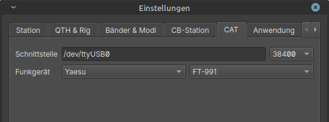

Hamlib integration
==================

You can use hamlib to interact with your radio. 

The QSO logging form and CassiopeiaConsole automatically updates radio information:
* frequency (and band)
* mode (and submode)
* power

Hamlib can be downloaded at https://github.com/Hamlib/Hamlib/releases.
DragonLog is tested against version 4.5.5, 4.6.2 and 4.6.5.

After selecting your radio and interface settings you can press the start button to start the communication.

Currently, DragonLog can only configure radios with serial interface (including USB serial).

### On Windows

Unpack or install your hamlib release.
On the CAT settings tab you have to select your hamlib unpack/installation directory.

### On Linux

If no package is available for your distribution you have to compile the hamlib release first. 
Download the release .tar.gz (not source), unpack, ./configure, make, make install.
The rigctld is assumed to be in /usr/local/bin and thus on your path.

